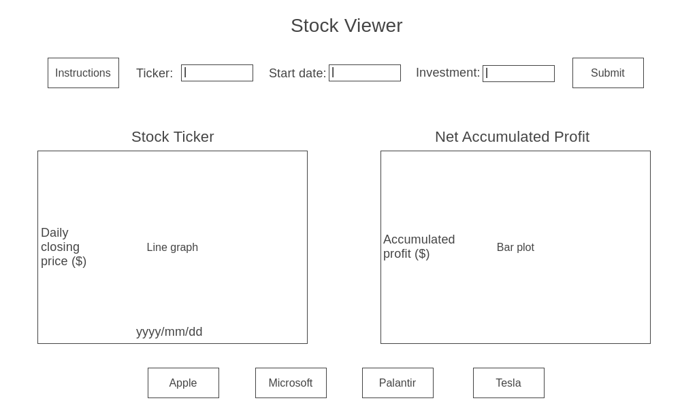

    Overview/Description of Project
    Live Link to the hosted project
    Screenshots/GIFs of project features
    1-2 Code Snippets showing something you did

<h1>Stock App</h1>

The main objective of this project is to create a visualization of a stock's price over the course of one year.

In the Stock App, users will be able to:
1) input a publicly traded U.S. stock ticker name
2) view the daily closing price of that stock on a line graph over the last 52-week period
3) view the minimum price, maximum price, and the maximum possible profit in the 52-week range
4) hover over the line graph to view the daily stock price

In addition, this project will include:

1) a link to the line graph of the most recently searched stock ticker
2) README.md file

<h1>Wireframe</h1>

<!--  -->

<h1>Technologies and APIs</h1>

This project will implement:
1) AlphaVantage API to pull stock data
2) D3 and Canvas to render the price graph
3) Webpack to bundle the source JavaScript code
4) npm to manage project dependencies
