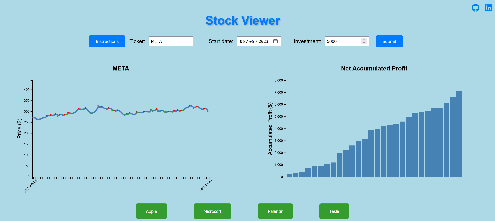
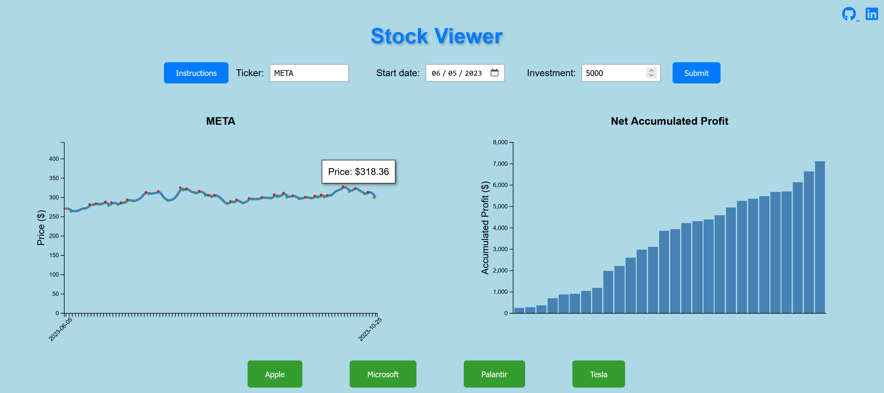

<h1>Stock Viewer</h1>

URL: https://nkachalia1.github.io/Stock-App/

Description

Welcome to the Stock Viewer, an interactive tool to visualize the historical prices of a particular stock and its maximum returns.

Instructions:

1) Enter a stock ticker name. For example, Starbucks is 'SBUX'
2) Enter a date in the past.
3) Enter a number amount of how much money you would like to invest.
4) Click Submit.
5) On the left, you will see a line graph. Feel free to hover over it to visualize daily prices. The green circles indicate best times to buy. The closest trailing red circle indicates the best time to sell.
6) On the right, you will see a bar chart. Hovering over it will display the best days to buy and sell your stock to accumulate profits.
7) After creating your first visualization, you can click on some common stocks at the bottom.

Technical Details

Stock Viewer is coded in JavaScript, HTML, and CSS. The visualization tools utilize D3. Webpack was used to bundle the source code and npm was used to manage project dependencies. Stock data was fetched using the AlphaVantage API and MarketStack API.

Usage

The home page displays a common stock's historical prices and corresponding net accumulated profit


Submitting a ticker symbol, start date, and investment amount will generate the entered stock's information



Hovering over the line and bar graphs populate relevant information



Feature Implementation

The line graph and bar plot were created using d3

```
            const margin = { top: 60, right: 20, bottom: 50, left: 50 };
            const width = 600 - margin.left - margin.right;
            const height = 400 - margin.top - margin.bottom;
            const buySellPoints = findBuySellPoints(closingPrices);

            const svg = d3.select('#chart-container')
            .append('svg')
            .attr('width', width + margin.left + margin.right)
            .attr('height', height + margin.top + margin.bottom)
            .append('g')
            .attr('transform', 'translate(' + margin.left + ',' + margin.top + ')');

            const x = d3.scaleBand().range([0, width]).padding(0.1);
            const y = d3.scaleLinear().domain([0, adjustedMaxPrice]).nice().range([height, 0]);
```

The hover technique was implemented with mousover funcionality

```
.on('mouseover', function(event) {
                const index = d3.select(this).attr('data-index');
                const tooltip = d3.select('#tooltip');
                tooltip.transition().duration(200).style('opacity', 0.8);
                tooltip.html(`Trade Dates: ${formattedDates[index]}`)
                    .style('left', event.pageX + 'px')
                    .style('top', event.pageY - 28 + 'px');
            })
            .on('mouseout', function() {
                d3.select('#tooltip').transition().duration(500).style('opacity', 0);
            });
```

Features in Development

Highlight the time window in the line chart that corresponds to the dates in the bar plot

Analyze stock news and combine this with the current data to predict future stock price
